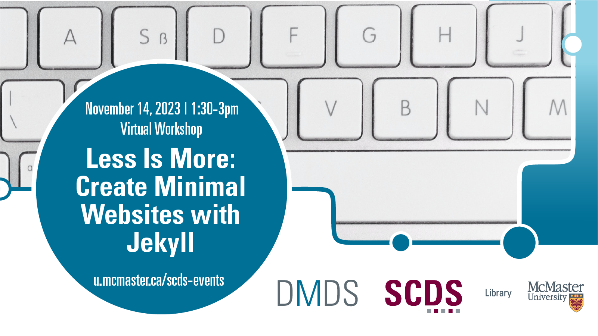

<!-- 
This will be the home page of your module. It should give a small introduction to the student about the workshop topic.
Add, edit, or remove any content below for the workshop in question. -->

<!-- Title slide image. Replace img src with your own, or comment this out. -->

<!-- Main header -->
# Less Is More: Create Minimal Websites with Jekyll

In this workshop, students will learn how to build a lightweight website using Jekyll and GitHub Pages.

Website-building platforms, like Squarespace and Wordpress, while convenient and user-friendly, can be costly, have limited customizability, and require continuous updates to stay afloat. Static sites, on the other hand, are pure html, css, and javascript. As such, they are free to build, endlessly customizable and, once generated, require little to no maintenance.

Jekyll is an open-source static site generator that offers the best of both worlds. In this workshop, students will start with a basic Jekyll website template. Then, we will walk through how to create and edit pages in Markdown, an easy to understand word processing language (like simpler html) that was created for blogging. Next we will explore how to customize the layout and design with CSS. Finally, students will learn how to deploy and host their finished site (for free!) on GitHub Pages.

## Prerequisites

<!-- If creating or installing is covered in the module (preparation), mention that in brackets. -->
- A [GitHub.com](https://www.github.com) account.
- Installation of [Jekyll](https://jekyllrb.com/docs/installation/). (This will be covered in the [Preparation](preparation) page)
- Experience with **Git/Version Control** is recommended but not required (See: [Intro to Version Control](https://scds.github.io/intro-git/) module).
- Some knowledge of with CSS/HTML is also helpful... but not required. You will learn!

<!-- What will the student learn to do, learn to use, etc. -->
## Learning Objectives
By the end of this workshop, you will be able to:
- Create a personal website with GitPages and Jekyll
- Choose a Jekyll theme
- Customize the CSS (styling)
- Create and edit page layout

<!-- Estimate the time the workshop will take to complete. Feel free to remove this. -->
## Duration (optional)
This module will take around 1 to 2 hours, however feel free to work at your own pace!

## Land Acknowledgement
McMaster University is situated in Ohròn:wakon which is the traditional territories of the Erie, Neutral, Huron-Wendat, Haudenosaunee and Mississaugas. This land is covered by the “Dish With One Spoon Wampum Belt Covenant”, an agreement between the Haudenosaunee confederacy and Anishinaabe nations to ensure those who live here take only what they need, leave enough in the dish for others, and keep the dish clean. This land is also covered by the Between the Lakes Treaty of 1792 and is very close to the 1784 Haldimand Treaty, which holds the land six miles to each side of the Grand River as a tract for Six Nations, which is currently not being honored. 

Many of us at the Sherman Centre took the First Nations' Information Governance Centre's OCAP course this past year which stands for Ownership, Control, Access, and Possession. We encourage you to learn [more about OCAP](https://fnigc.ca/ocap-training/take-the-course/) and Indigenous data management practices more broadly, including the [OCAS principles](https://u.mcmaster.ca/ocas-framework) endorsed by the Manitoba Métis Federation, the principles of [Inuit Qaujimajatuqangit](https://doi.org/10.1139/as-2020-0015), ᐃᓄᐃᑦ ᑕᐱᕇᑦ ᑲᓇᑕᒥ (Inuit Tapiriit Kanatami) [National Inuit Strategy on Research](https://www.itk.ca/national-strategy-on-research-launched/), and Global Indigenous Data Alliance’s [CARE principles](https://www.gida-global.org/care).  
