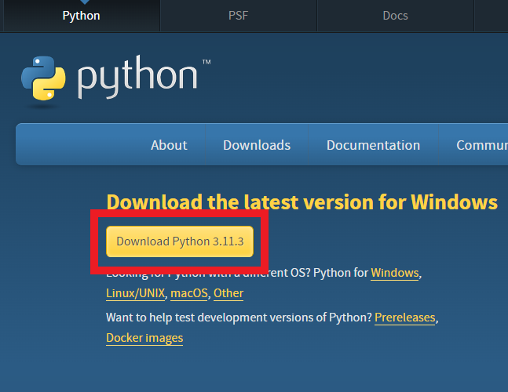

<!-- 
(OPTIONAL) This will be the page going over any installation or registration requirements.
Add, edit, or remove any content below for the workshop in question. 
-->

# Workshop preparation 

<!-- 
Seperate preparation into account creation, file downloads, and software downloads.
However, you can format this as you wish.
An example is provided below.
-->
## 1. Create a GitHub Account
- [Navigate to GitHub](https://github.com/) and sign up for an account if you don’t already have one.
- After registering, sign in to your account.

## 2. Install Jekyll
This hands-on workshop uses [Jekyll](https://jekyllrb.com/docs/installation/). Please install *Jekyll* in advance of the workshop to be able to participate in it to the fullest extent.

*Note: To install and run Jekyll, you will need to use your computer's *Command Line* interface i.e. Terminal.

- Open Terminal (On a mac, type Cmd + spacebar) and search "Terminal."
- In terminall, install the necessary software: Homebrew, chruby, and Ruby (See [Jekyll Installation](https://jekyllrb.com/docs/installation/) for instructions.
- Install Jekyll
```
gem install jekyll
```
- Install Jekyll bundler
```
gem install jekyll bundler
```

<!-- 
## 3. Download website template
You will have an opportunity to download the data during the workshop; however, if you would like to do so ahead of time, it can be downloaded [here](https://www.google.com).
-->

<!-- 

{: .warning }
> This is a warning message. You can use to to mention things like:
>
> - Must be a McMaster Student/Staff to access content/software licenses
> - Windows/MacOS/Linux is not supported

-->

<!-- 
### Windows/Mac Installation
<!-- Usually, linking to an installation guide on the official website of the software is enough, no need to explain how to install. -->
<!-- If there are additional steps not covered in the installation guide, include them -->
<!-- - Steps for installation.

    

- More guidance can be found [here](https://www.google.com).

### Linux Installation
- Steps for installation.
- More steps for installation.
- More guidance can be found [here](https://www.google.com).

-->
